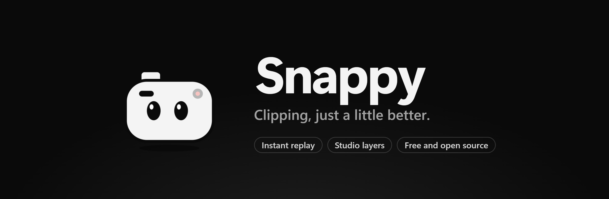

<p align="center">
  
</p>

<p align="center">
  <a href="https://github.com/slashneck/Snappy/releases/latest"></a>
  <a href="https://github.com/slashneck/Snappy/releases"></a>
  
  <a href="LICENSE"></a>
</p>

<p align="center">
  <a href="https://github.com/slashneck/Snappy/releases/latest"><b>Download for Windows</b></a>
  &nbsp;&nbsp;|&nbsp;&nbsp;
  <a href="#features">Features</a>
  &nbsp;&nbsp;|&nbsp;&nbsp;
  <a href="#studio">Studio</a>
  &nbsp;&nbsp;|&nbsp;&nbsp;
  <a href="#building">Build it yourself</a>
</p>

<br>

Snappy keeps the last few minutes of your screen in memory and saves them as a clip when you press a hotkey. Think
ShadowPlay's Instant Replay, minus the parts that get in your way: it never touches your microphone settings, keeps
recording when music is playing, and only writes to your disk when you actually save something.

## Features

**Instant replay.** Up to 30 minutes, kept in RAM and encoded on your graphics card (NVIDIA NVENC, AMD AMF, or the CPU
as a fallback). Desktop audio and your mic land on separate tracks, and the mic you picked stays picked.

**A library that sorts itself.** Every clip goes into a folder for the game or app you were in. Favorites, search and
hover previews are built in, and moving a clip in Snappy moves the file on disk.

**Edit without another app.** Trim to the exact frame, crop, mute parts of a track, grab a frame as a picture, or shrink
a clip so it fits Discord's upload limit. Several clips can be joined into a montage.

**Little things.** Screenshots with a hotkey, sorted per game like clips. Mark a moment while you play and find it again
on the clip's timeline. An optional storage limit sends your oldest clips to the Recycle Bin, and never your favorites.

## Studio

Put pictures, GIFs, your facecam or your key presses into your clips. Layers are drawn into the recording only, so they
never show up on your screen while you play.

Scenes work like in OBS: set up one for your shooter with WASD on screen and another for League with QWER, link each to
its game, and Snappy switches on its own when you start playing. One switch turns every layer off again when you want
raw clips, without losing your setup.

## Install

Download `SnappySetup` from the [latest release](https://github.com/slashneck/Snappy/releases/latest) and run it. It
installs for your Windows account only, so no admin rights are needed, and it keeps itself up to date.

The setup isn't code signed yet, so Windows SmartScreen may say it "protected your PC". Click **More info** and then
**Run anyway**. Every release lists the SHA-256 checksum of its files.

You need Windows 10 (version 1903 or newer) or Windows 11, 64 bit. The window uses the Microsoft WebView2 Runtime, which
comes with Windows 11 and most Windows 10 PCs.

## Hotkeys

| Action | Default |
| --- | --- |
| Save the replay | <kbd>Alt</kbd> + <kbd>F10</kbd> |
| Save a quick clip | <kbd>Alt</kbd> + <kbd>F9</kbd> |
| Take a screenshot | <kbd>Alt</kbd> + <kbd>F1</kbd> |
| Mark a moment | not set |

Everything can be changed in Settings.

## Where your files are

| What | Where |
| --- | --- |
| Clips | `Videos\Snappy` (changeable) |
| Screenshots | `Pictures\Snappy` (changeable) |
| Settings and Studio scenes | `%AppData%\Snappy` |
| The program | `%LocalAppData%\Programs\Snappy` |

Updates only replace program files. Uninstalling removes the program and leaves your clips, screenshots, settings and
Studio scenes where they are.

## Privacy

Everything Snappy records stays on your PC. There is no account, no telemetry and no upload. The only thing Snappy does
online is ask GitHub whether a new version exists, and you can switch that off under Settings, About.

## Building

You need the .NET 8 SDK.

```powershell
.\build-release.ps1
```

The script downloads the pinned FFmpeg build, publishes Snappy and writes the setup, the update zip with its checksum
and a source zip to `dist`. For development, run it once (or put `ffmpeg.exe` into `ffmpeg\` yourself) and then use
`dotnet run --project src\Snappy`.

## License

Copyright (C) 2026 slashneck. Snappy is free software under the [GNU General Public License version 3](LICENSE): you can
use, change and share it, and any version you share has to stay under the same license with its source code available.
The license doesn't cover the Snappy name or logo (GPLv3 section 7e), so please give modified versions their own name.

Snappy includes FFmpeg (GPL 3.0), the WebView2 SDK and the .NET runtime. See [THIRD-PARTY-NOTICES.md](THIRD-PARTY-NOTICES.md).
